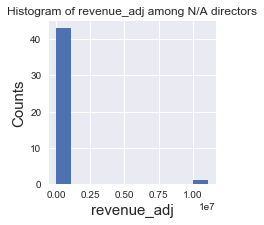
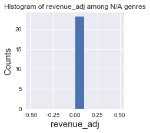
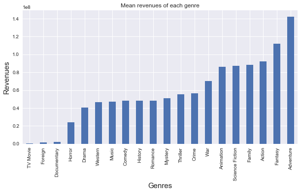
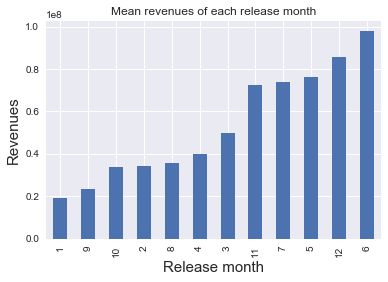
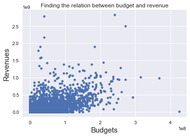
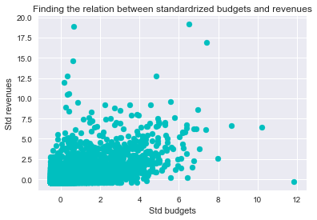

# Project: Investigate the TMDB movie dataset

## Table of Contents
<ul>
<li><a href="#intro">Introduction</a></li>
<li><a href="#wrangling">Data Wrangling</a></li>
<li><a href="#eda">Exploratory Data Analysis</a></li>
<li><a href="#conclusions">Conclusions</a></li>
</ul>

<a id='intro'></a>
## Introduction
In this project, I'll analyze the movie dataset which contains information about 10,000 movies collected from The Movie Database (TMDb), including user ratings and revenue. I'll be interested in finding the key variables that make the movie profit.


```python
# Remember to include a 'magic word' so that your visualizations are plotted
#   inline with the notebook. See this page for more:
#   http://ipython.readthedocs.io/en/stable/interactive/magics.html

import pandas as pd
import numpy as np
import matplotlib.pyplot as plt
import seaborn as sns
% matplotlib inline

```

<a id='wrangling'></a>
## Data Wrangling

### General Properties

After loading the CSV file, I found that the original dataset has 10886 rows and 21 columns.


```python
# Load the CSV file first and check its dimensions
df = pd.read_csv('tmdb-movies.csv');
df.shape

```


    (10866, 21)


However, there are too many columns and it's hard to observe them in a limited space even if I use **df.head()** function.
Hence, I also use **df.columns** to observe the general properties.


```python
# The display space is limited, so use df.columns to observe all the columns
df.columns
```


    Index(['id', 'imdb_id', 'popularity', 'budget', 'revenue', 'original_title',
           'cast', 'homepage', 'director', 'tagline', 'keywords', 'overview',
           'runtime', 'genres', 'production_companies', 'release_date',
           'vote_count', 'vote_average', 'release_year', 'budget_adj',
           'revenue_adj'],
          dtype='object')


### Data Cleaning
After observing the dataset, I found there are many useless columns, and it's annoying to drop them by specifying so many columns names in drop function. Instead, I'll choose the interested columns and create a new dataframe.


```python
# Pick up the interested columns from the original one and recreate a new data frame
interested_columns = ['popularity', 'director','genres', 'release_date', 'release_year', 'budget_adj', 'revenue_adj'];
df = pd.DataFrame(df, columns=interested_columns);

df.head()
```


<div>
<table border="1" class="dataframe">
  <thead>
    <tr style="text-align: right;">
      <th></th>
      <th>popularity</th>
      <th>director</th>
      <th>genres</th>
      <th>release_date</th>
      <th>release_year</th>
      <th>budget_adj</th>
      <th>revenue_adj</th>
    </tr>
  </thead>
  <tbody>
    <tr>
      <th>0</th>
      <td>32.985763</td>
      <td>Colin Trevorrow</td>
      <td>Action|Adventure|Science Fiction|Thriller</td>
      <td>6/9/15</td>
      <td>2015</td>
      <td>1.379999e+08</td>
      <td>1.392446e+09</td>
    </tr>
    <tr>
      <th>1</th>
      <td>28.419936</td>
      <td>George Miller</td>
      <td>Action|Adventure|Science Fiction|Thriller</td>
      <td>5/13/15</td>
      <td>2015</td>
      <td>1.379999e+08</td>
      <td>3.481613e+08</td>
    </tr>
    <tr>
      <th>2</th>
      <td>13.112507</td>
      <td>Robert Schwentke</td>
      <td>Adventure|Science Fiction|Thriller</td>
      <td>3/18/15</td>
      <td>2015</td>
      <td>1.012000e+08</td>
      <td>2.716190e+08</td>
    </tr>
    <tr>
      <th>3</th>
      <td>11.173104</td>
      <td>J.J. Abrams</td>
      <td>Action|Adventure|Science Fiction|Fantasy</td>
      <td>12/15/15</td>
      <td>2015</td>
      <td>1.839999e+08</td>
      <td>1.902723e+09</td>
    </tr>
    <tr>
      <th>4</th>
      <td>9.335014</td>
      <td>James Wan</td>
      <td>Action|Crime|Thriller</td>
      <td>4/1/15</td>
      <td>2015</td>
      <td>1.747999e+08</td>
      <td>1.385749e+09</td>
    </tr>
  </tbody>
</table>
</div>


### Deal with missing data
Now, the dataset looks more clear and meaningful. And I would like to check if there are some miss data.


```python
# Check if there are some missing data by using info()
df.info()
```

    <class 'pandas.core.frame.DataFrame'>
    RangeIndex: 10866 entries, 0 to 10865
    Data columns (total 7 columns):
    popularity      10866 non-null float64
    director        10822 non-null object
    genres          10843 non-null object
    release_date    10866 non-null object
    release_year    10866 non-null int64
    budget_adj      10866 non-null float64
    revenue_adj     10866 non-null float64
    dtypes: float64(3), int64(1), object(3)
    memory usage: 594.3+ KB


Unfortunately, I found that **director** and **genres** have some missing rows. I need to check if I can drop them without hesitation.


```python
# Plot the histogram of revenue_adj among N/A directors
na_directors = df['director'].isnull();  # Create an index array which indicates the N/A rows of director column
df[na_directors]['revenue_adj'].plot(kind='hist', figsize=(3,3), title='Histogram of revenue_adj among N/A directors')

plt.xlabel('revenue_adj', fontsize=15)
plt.ylabel('Counts', fontsize=15)
```


    <matplotlib.text.Text at 0x10fdf2cf8>





The above histogram shows that most of those rows with N/A director column contribue zero revenue.

Again, check the histogram of revenue_adj among N/A genres.


```python
# Plot the histogram of revenue_adj among N/A genres
na_genres = df['genres'].isnull();  # Create an index array which indicates the N/A rows of genres column
df[na_genres]['revenue_adj'].plot(kind='hist', figsize=(3,3), title='Histogram of revenue_adj among N/A genres')

plt.xlabel('revenue_adj', fontsize=15)
plt.ylabel('Counts', fontsize=15)
```


    <matplotlib.text.Text at 0x10392d358>





The above histogram shows that ALL of those rows with N/A genres column contribue zero revenue.

Finally, I'll check the statistics of revenue_adj.


```python
# Check the statistics of revenue_adj
df['revenue_adj'].describe()
```


    count    1.086600e+04
    mean     5.136436e+07
    std      1.446325e+08
    min      0.000000e+00
    25%      0.000000e+00
    50%      0.000000e+00
    75%      3.369710e+07
    max      2.827124e+09
    Name: revenue_adj, dtype: float64


After visualizing the histogram of those missing rows and checking the statistic of revenue_adj, I found that **those  rows with N/A column contribue less or no profit**, which means I can drop them directly. 


```python
# Drop the N/A column and check the data integrity again
df.dropna(inplace=True)
df.info()
```

    <class 'pandas.core.frame.DataFrame'>
    Int64Index: 10801 entries, 0 to 10865
    Data columns (total 7 columns):
    popularity      10801 non-null float64
    director        10801 non-null object
    genres          10801 non-null object
    release_date    10801 non-null object
    release_year    10801 non-null int64
    budget_adj      10801 non-null float64
    revenue_adj     10801 non-null float64
    dtypes: float64(3), int64(1), object(3)
    memory usage: 675.1+ KB


### Extract the data
According to the notes, genres column contains multiple values separated by pipe (|) characters.


```python
# Briefly check the data in genres column
df['genres'][0]
```


    'Action|Adventure|Science Fiction|Thriller'


Although I can ignore this and start to analyze which kind of **genres combination** has max profit, I don't think it's a good idea and can get meaningful result. So, I determine to parse the string and split them to seperate columns. But, the problem is: **I don't know the total number of genres. How can I know how many additional columns I should create ?**

After thinking for a while and going through all the tools I have, I determine to use **set** to come out all the genres.


```python
genres = df['genres'].drop_duplicates();  # Use drop_duplicate to remove redundant rows (optional)
genre_types_set = set();  # Create an empty set first
for con_genre in genres:  # For each concatenated string like 'Action|Adventure|Science Fiction|Thriller'
    genre_list = con_genre.split('|');  # Split them
    for genre_type in genre_list:
        genre_types_set.add(genre_type)  # Put it to the set

genre_types_set  # Show ALL kinds of genres
```


    {'Action',
     'Adventure',
     'Animation',
     'Comedy',
     'Crime',
     'Documentary',
     'Drama',
     'Family',
     'Fantasy',
     'Foreign',
     'History',
     'Horror',
     'Music',
     'Mystery',
     'Romance',
     'Science Fiction',
     'TV Movie',
     'Thriller',
     'War',
     'Western'}


And use **apply** function to check if the element in genres column is a specfic genre, and marks 'Y' or 'N' respectively.


```python
for genre_type in genre_types_set:  # For each genre type
    # Create a new column named by the specific genre type from the original genres column
    df[genre_type] = df['genres'].apply(lambda x: 'N' if x.find(genre_type) == -1 else 'Y')

df.iloc[0] # Check if the result is correct
```


    popularity                                           32.9858
    director                                     Colin Trevorrow
    genres             Action|Adventure|Science Fiction|Thriller
    release_date                                          6/9/15
    release_year                                            2015
    budget_adj                                          1.38e+08
    revenue_adj                                      1.39245e+09
    Science Fiction                                            Y
    Foreign                                                    N
    Comedy                                                     N
    Drama                                                      N
    Animation                                                  N
    Romance                                                    N
    History                                                    N
    Documentary                                                N
    Horror                                                     N
    Fantasy                                                    N
    Crime                                                      N
    Family                                                     N
    War                                                        N
    Adventure                                                  Y
    Action                                                     Y
    Mystery                                                    N
    Music                                                      N
    TV Movie                                                   N
    Western                                                    N
    Thriller                                                   Y
    Name: 0, dtype: object


From the above ouput, you can see **it's marked as 'Y'** in Action, Adventure, Science Fiction, and Thriller columns.

Besides, for personal reason, I would like to analyze if the release month is an important variable. (Because in Asia, the summer vacation starts from July, some super hero movies are also annouced at that time.)
So I extract the release month as well.


```python
# Create a new column which is named release_month from the existing release_date column
df['release_month'] = df['release_date'].apply(lambda x: x.split('/')[0]);
```

<a id='eda'></a>
## Exploratory Data Analysis

### How's the average revenue between each genre ? Which one may have highest revenue ?

First, groupby each genre, and get its mean revenue. Don't forget that **df.groupby(genre).revenue_adj.mean() is a pandas series**, and use **loc** to access the element.


```python
revenues = [];  # Initialize an empty revenues list, and it would be used as value of the pandas series
index_genre = [];  # Initialize an empty genre list, and it would be used as index of the pandas series
for genre in genre_types_set:  # For each genre type, eg Action, Science Fiction, etc
    revenue = df.groupby(genre).revenue_adj.mean().loc['Y'];  # Groupby that genre type and find the mean revenue
    revenues.append(revenue)  # Record the revenue
    index_genre.append(genre)  # Record this genre

# Obtain the revenue from each genre, and construct a new Series, so that I could plot the bar chart easily.
revenues_of_each_genre = pd.Series(data=revenues, index=index_genre)
```

Before plotting the bar chart, I sort the Series to get an easy-understanding result and nice visualization.


```python
revenues_of_each_genre.sort_values(inplace=True)  # Sort the series for better visualization
revenues_of_each_genre.plot(kind='bar', figsize=(10,5), title='Mean revenues of each genre')
plt.xlabel('Genres', fontsize=15)
plt.ylabel('Revenues', fontsize=15)
```


    <matplotlib.text.Text at 0x10c2db1d0>





From the above ouput, obviously, making an adventure movie has the highest revenue.

### What's the average revenue in each month ? Which one may have highest revenue ?

Similarly, use groupby to get the mean revenue of each month and plot its result.


```python
revenues_of_each_month = df.groupby('release_month').revenue_adj.mean()
revenues_of_each_month.sort_values(inplace=True);
revenues_of_each_month.plot(kind='bar', title='Mean revenues of each release month')
plt.xlabel('Release month', fontsize=15)
plt.ylabel('Revenues', fontsize=15)
```


    <matplotlib.text.Text at 0x10c2d93c8>





The above figure shows that the movie produced in June has the highest revenue, and December is the second.

### How's the relation between budget and revenue ?

Use scatter plot to observe the relation.


```python
# Use scatter plot to observe the relation between budget_adj and revenue_adj
df.plot(x='budget_adj', y='revenue_adj', kind='scatter', title='Finding the relation between budget and revenue')
plt.xlabel('Budgets', fontsize=15)
plt.ylabel('Revenues', fontsize=15)
```


    <matplotlib.text.Text at 0x10c1d4898>





From the above figure, it seems that they are positive related ... ? But it's not obvious and clear.

So, I wonder if I should standardrize the variables. Anyway, just try it !


```python
std_budget = (df['budget_adj'] - df['budget_adj'].mean())/df['budget_adj'].std(ddof=0)  # Standarize budget_adj
std_revenue = (df['revenue_adj'] - df['revenue_adj'].mean())/df['revenue_adj'].std(ddof=0)  # Standarize revenue_adj
plt.scatter(x=std_budget, y=std_revenue, c='c')  # Show the scatter plot and set the color as cyan
plt.xlabel("Std budgets")
plt.ylabel("Std revenues")
plt.title("Finding the relation between standardrized budgets and revenues")
plt.show()
```





Well, after standarizing the variables, I still do not get a confident conclusion.
So, I'll compute the correlation coefficient directly.


```python
# Compute Pearson's r
pearson_r = df['budget_adj'].corr(df['revenue_adj'], method='pearson')
print(pearson_r)
```

    0.646271717358


Because the correlation coefficient sits in [-1, 1], the above value shows that budget and revenue are **positive-related**.

### Which genres are most popular from year to year ?

The idea is simple: Groupby the release_year column and compute the highest popularity of that year.


```python
# Simply check if the groupby result is correct
df.groupby(['release_year'])['popularity'].max().head()
```


    release_year
    1960    2.610362
    1961    2.631987
    1962    3.170651
    1963    2.508235
    1964    3.153791
    Name: popularity, dtype: float64


But I need to know the row index of that year so that I can query the genres.
**idxmax()** is a good thing.


```python
# The index of this SeriesGroupBy object is release_year, 
# and the value is its row index which has highest popularity in that year
max_popularity_index = df.groupby(['release_year'])['popularity'].idxmax();

highest_popularity_genres = pd.Series();
for i, v in max_popularity_index.items():  # i is release year, v is row index which has highest popularity in that year
    highest_popularity_genres.loc[i] = df.loc[v, 'genres']

highest_popularity_genres  # Show the result, note that its index is release year and its value is genre
```


    1960                                Drama|Horror|Thriller
    1961                    Adventure|Animation|Comedy|Family
    1962                            Adventure|Action|Thriller
    1963                            Action|Thriller|Adventure
    1964                            Adventure|Action|Thriller
    1965                            Adventure|Action|Thriller
    1966                              Animation|Family|Comedy
    1967                           Family|Animation|Adventure
    1968                    Science Fiction|Mystery|Adventure
    1969                            Adventure|Action|Thriller
    1970                    Animation|Comedy|Family|Adventure
    1971                                Science Fiction|Drama
    1972                                          Drama|Crime
    1973                                     Animation|Family
    1974                                          Drama|Crime
    1975                                                Drama
    1976                                          Crime|Drama
    1977                     Adventure|Action|Science Fiction
    1978                                                Music
    1979               Horror|Action|Thriller|Science Fiction
    1980                     Adventure|Action|Science Fiction
    1981                                     Adventure|Action
    1982                       Science Fiction|Drama|Thriller
    1983                     Adventure|Action|Science Fiction
    1984                      Action|Thriller|Science Fiction
    1985              Adventure|Comedy|Science Fiction|Family
    1986               Horror|Action|Thriller|Science Fiction
    1987            Science Fiction|Action|Adventure|Thriller
    1988                                      Action|Thriller
    1989                                     Animation|Family
    1990                     Action|Adventure|Science Fiction
    1991               Romance|Family|Animation|Fantasy|Music
    1992                                       Crime|Thriller
    1993                         Romance|Fantasy|Drama|Comedy
    1994                                       Thriller|Crime
    1995                               Crime|Mystery|Thriller
    1996                     Action|Adventure|Science Fiction
    1997                                               Comedy
    1998                                         Comedy|Drama
    1999                                                Drama
    2000                               Action|Drama|Adventure
    2001                             Adventure|Fantasy|Action
    2002                             Adventure|Fantasy|Action
    2003                             Adventure|Fantasy|Action
    2004                             Adventure|Fantasy|Family
    2005                             Adventure|Fantasy|Family
    2006              Fantasy|Action|Science Fiction|Thriller
    2007                             Adventure|Fantasy|Action
    2008                          Drama|Action|Crime|Thriller
    2009             Action|Adventure|Fantasy|Science Fiction
    2010    Action|Thriller|Science Fiction|Mystery|Adventure
    2011                              Action|Animation|Horror
    2012                     Science Fiction|Action|Adventure
    2013                           Animation|Adventure|Family
    2014                      Adventure|Drama|Science Fiction
    2015            Action|Adventure|Science Fiction|Thriller
    dtype: object


The ouput shows the most popular genres from year to year.

### Among all the directors, who produce the most profitable film ?

Simply groupby the director, and check the max revenue.


```python
# Groupby the director, check the max revenue, and use idxmax to find the name
df.groupby('director').revenue_adj.max().idxmax()
```


    'James Cameron'


## Limitations

I would say that the last two analyses reveal the limitations. First, I DID find the most popular genres in each year, but I would say the result is less useful because it is a genres combination which is not straightforward. I try to groupby release year and each genere at the same time, but the result is multi-dimensional and hard to analyze.


```python
# Create a list which includes all genres and append it with release year
l = list(genre_types_set)
l.append('release_year')

# Groupby release year and all generes at the same time
df.groupby(l).max()
```


<div>
<table border="1" class="dataframe">
  <thead>
    <tr style="text-align: right;">
      <th></th>
      <th></th>
      <th></th>
      <th></th>
      <th></th>
      <th></th>
      <th></th>
      <th></th>
      <th></th>
      <th></th>
      <th></th>
      <th></th>
      <th></th>
      <th></th>
      <th></th>
      <th></th>
      <th></th>
      <th></th>
      <th></th>
      <th></th>
      <th></th>
      <th>popularity</th>
      <th>director</th>
      <th>genres</th>
      <th>release_date</th>
      <th>budget_adj</th>
      <th>revenue_adj</th>
      <th>release_month</th>
    </tr>
    <tr>
      <th>Science Fiction</th>
      <th>Foreign</th>
      <th>Comedy</th>
      <th>Drama</th>
      <th>Animation</th>
      <th>Romance</th>
      <th>History</th>
      <th>Documentary</th>
      <th>Horror</th>
      <th>Fantasy</th>
      <th>Crime</th>
      <th>Family</th>
      <th>War</th>
      <th>Adventure</th>
      <th>Action</th>
      <th>Mystery</th>
      <th>Music</th>
      <th>TV Movie</th>
      <th>Western</th>
      <th>Thriller</th>
      <th>release_year</th>
      <th></th>
      <th></th>
      <th></th>
      <th></th>
      <th></th>
      <th></th>
      <th></th>
    </tr>
  </thead>
  <tbody>
    <tr>
      <th rowspan="30" valign="top">N</th>
      <th rowspan="30" valign="top">N</th>
      <th rowspan="30" valign="top">N</th>
      <th rowspan="30" valign="top">N</th>
      <th rowspan="30" valign="top">N</th>
      <th rowspan="30" valign="top">N</th>
      <th rowspan="30" valign="top">N</th>
      <th rowspan="30" valign="top">N</th>
      <th rowspan="30" valign="top">N</th>
      <th rowspan="30" valign="top">N</th>
      <th rowspan="30" valign="top">N</th>
      <th rowspan="30" valign="top">N</th>
      <th rowspan="30" valign="top">N</th>
      <th rowspan="30" valign="top">N</th>
      <th rowspan="30" valign="top">N</th>
      <th rowspan="30" valign="top">N</th>
      <th rowspan="30" valign="top">N</th>
      <th rowspan="30" valign="top">N</th>
      <th rowspan="22" valign="top">N</th>
      <th rowspan="22" valign="top">Y</th>
      <th>1960</th>
      <td>0.232574</td>
      <td>David Miller</td>
      <td>Thriller</td>
      <td>10/13/60</td>
      <td>0.000000e+00</td>
      <td>0.000000e+00</td>
      <td>10</td>
    </tr>
    <tr>
      <th>1965</th>
      <td>0.306394</td>
      <td>Sidney J. Furie</td>
      <td>Thriller</td>
      <td>3/18/65</td>
      <td>0.000000e+00</td>
      <td>0.000000e+00</td>
      <td>3</td>
    </tr>
    <tr>
      <th>1966</th>
      <td>0.102530</td>
      <td>Guy Hamilton</td>
      <td>Thriller</td>
      <td>12/22/66</td>
      <td>0.000000e+00</td>
      <td>0.000000e+00</td>
      <td>12</td>
    </tr>
    <tr>
      <th>1967</th>
      <td>0.502062</td>
      <td>Ken Russell</td>
      <td>Thriller</td>
      <td>11/2/67</td>
      <td>0.000000e+00</td>
      <td>0.000000e+00</td>
      <td>11</td>
    </tr>
    <tr>
      <th>1976</th>
      <td>0.522601</td>
      <td>John Schlesinger</td>
      <td>Thriller</td>
      <td>10/5/76</td>
      <td>2.490604e+07</td>
      <td>8.318241e+07</td>
      <td>10</td>
    </tr>
    <tr>
      <th>1990</th>
      <td>0.411888</td>
      <td>Kathryn Bigelow</td>
      <td>Thriller</td>
      <td>3/16/90</td>
      <td>0.000000e+00</td>
      <td>0.000000e+00</td>
      <td>3</td>
    </tr>
    <tr>
      <th>1992</th>
      <td>0.702115</td>
      <td>Katt Shea</td>
      <td>Thriller</td>
      <td>8/14/92</td>
      <td>2.486439e+07</td>
      <td>7.462021e+07</td>
      <td>8</td>
    </tr>
    <tr>
      <th>1997</th>
      <td>0.706041</td>
      <td>Oliver Stone</td>
      <td>Thriller</td>
      <td>10/3/97</td>
      <td>2.581075e+07</td>
      <td>9.077365e+06</td>
      <td>10</td>
    </tr>
    <tr>
      <th>1998</th>
      <td>0.539133</td>
      <td>Sam Raimi</td>
      <td>Thriller</td>
      <td>8/13/98</td>
      <td>9.363868e+07</td>
      <td>6.490877e+07</td>
      <td>8</td>
    </tr>
    <tr>
      <th>2000</th>
      <td>0.525341</td>
      <td>Mary Lambert</td>
      <td>Thriller</td>
      <td>7/19/00</td>
      <td>5.318427e+07</td>
      <td>4.073531e+07</td>
      <td>7</td>
    </tr>
    <tr>
      <th>2001</th>
      <td>0.651040</td>
      <td>Tom McLoughlin</td>
      <td>Thriller</td>
      <td>9/28/01</td>
      <td>6.157441e+07</td>
      <td>1.231736e+08</td>
      <td>9</td>
    </tr>
    <tr>
      <th>2005</th>
      <td>0.718616</td>
      <td>Jean-François Richet</td>
      <td>Thriller</td>
      <td>1/19/05</td>
      <td>3.349690e+07</td>
      <td>3.940851e+07</td>
      <td>1</td>
    </tr>
    <tr>
      <th>2006</th>
      <td>0.546313</td>
      <td>Richard Loncraine</td>
      <td>Thriller</td>
      <td>2/10/06</td>
      <td>4.867511e+07</td>
      <td>8.956221e+07</td>
      <td>2</td>
    </tr>
    <tr>
      <th>2007</th>
      <td>1.219374</td>
      <td>Kenneth Branagh</td>
      <td>Thriller</td>
      <td>4/27/07</td>
      <td>0.000000e+00</td>
      <td>4.101507e+07</td>
      <td>4</td>
    </tr>
    <tr>
      <th>2008</th>
      <td>0.436441</td>
      <td>Jennifer Chambers Lynch</td>
      <td>Thriller</td>
      <td>9/25/08</td>
      <td>5.823523e+06</td>
      <td>1.129756e+06</td>
      <td>9</td>
    </tr>
    <tr>
      <th>2009</th>
      <td>0.508705</td>
      <td>Tony Gilroy</td>
      <td>Thriller</td>
      <td>3/19/09</td>
      <td>7.942829e+07</td>
      <td>6.098403e+07</td>
      <td>3</td>
    </tr>
    <tr>
      <th>2010</th>
      <td>0.538392</td>
      <td>Doze Niu Cheng-Tse</td>
      <td>Thriller</td>
      <td>2/5/10</td>
      <td>0.000000e+00</td>
      <td>3.065860e+06</td>
      <td>2</td>
    </tr>
    <tr>
      <th>2011</th>
      <td>1.934043</td>
      <td>Stig Svendsen</td>
      <td>Thriller</td>
      <td>9/6/11</td>
      <td>4.071472e+07</td>
      <td>8.643363e+07</td>
      <td>9</td>
    </tr>
    <tr>
      <th>2012</th>
      <td>1.774202</td>
      <td>Steven Soderbergh</td>
      <td>Thriller</td>
      <td>9/19/12</td>
      <td>2.469335e+07</td>
      <td>3.169544e+07</td>
      <td>9</td>
    </tr>
    <tr>
      <th>2013</th>
      <td>1.559076</td>
      <td>Uwe Boll</td>
      <td>Thriller</td>
      <td>9/13/13</td>
      <td>1.216843e+07</td>
      <td>6.418603e+07</td>
      <td>9</td>
    </tr>
    <tr>
      <th>2014</th>
      <td>3.280948</td>
      <td>Sam Miller</td>
      <td>Thriller</td>
      <td>9/19/14</td>
      <td>1.381637e+07</td>
      <td>4.958271e+07</td>
      <td>9</td>
    </tr>
    <tr>
      <th>2015</th>
      <td>2.272044</td>
      <td>William Monahan</td>
      <td>Thriller</td>
      <td>8/7/15</td>
      <td>7.359997e+06</td>
      <td>4.615003e+07</td>
      <td>8</td>
    </tr>
    <tr>
      <th rowspan="8" valign="top">Y</th>
      <th rowspan="8" valign="top">N</th>
      <th>1961</th>
      <td>0.070127</td>
      <td>John Ford</td>
      <td>Western</td>
      <td>7/26/61</td>
      <td>0.000000e+00</td>
      <td>0.000000e+00</td>
      <td>7</td>
    </tr>
    <tr>
      <th>1962</th>
      <td>0.507078</td>
      <td>John Ford</td>
      <td>Western</td>
      <td>4/22/62</td>
      <td>2.306704e+07</td>
      <td>5.766759e+07</td>
      <td>4</td>
    </tr>
    <tr>
      <th>1966</th>
      <td>0.264925</td>
      <td>Monte Hellman</td>
      <td>Western</td>
      <td>5/31/66</td>
      <td>5.038511e+05</td>
      <td>0.000000e+00</td>
      <td>5</td>
    </tr>
    <tr>
      <th>1967</th>
      <td>0.139647</td>
      <td>Burt Kennedy</td>
      <td>Western</td>
      <td>5/27/67</td>
      <td>0.000000e+00</td>
      <td>3.922058e+07</td>
      <td>5</td>
    </tr>
    <tr>
      <th>1968</th>
      <td>0.621202</td>
      <td>Ted Post</td>
      <td>Western</td>
      <td>7/31/68</td>
      <td>1.128413e+07</td>
      <td>4.262895e+07</td>
      <td>7</td>
    </tr>
    <tr>
      <th>1970</th>
      <td>0.568645</td>
      <td>Don Siegel</td>
      <td>Western</td>
      <td>6/16/70</td>
      <td>0.000000e+00</td>
      <td>2.836266e+07</td>
      <td>6</td>
    </tr>
    <tr>
      <th>1971</th>
      <td>0.306073</td>
      <td>Sergio Leone</td>
      <td>Western</td>
      <td>6/24/71</td>
      <td>0.000000e+00</td>
      <td>0.000000e+00</td>
      <td>6</td>
    </tr>
    <tr>
      <th>1972</th>
      <td>0.476664</td>
      <td>John Sturges</td>
      <td>Western</td>
      <td>7/14/72</td>
      <td>0.000000e+00</td>
      <td>3.300817e+07</td>
      <td>7</td>
    </tr>
    <tr>
      <th>...</th>
      <th>...</th>
      <th>...</th>
      <th>...</th>
      <th>...</th>
      <th>...</th>
      <th>...</th>
      <th>...</th>
      <th>...</th>
      <th>...</th>
      <th>...</th>
      <th>...</th>
      <th>...</th>
      <th>...</th>
      <th>...</th>
      <th>...</th>
      <th>...</th>
      <th>...</th>
      <th>...</th>
      <th>...</th>
      <th>...</th>
      <td>...</td>
      <td>...</td>
      <td>...</td>
      <td>...</td>
      <td>...</td>
      <td>...</td>
      <td>...</td>
    </tr>
    <tr>
      <th rowspan="30" valign="top">Y</th>
      <th rowspan="21" valign="top">N</th>
      <th rowspan="21" valign="top">Y</th>
      <th rowspan="21" valign="top">Y</th>
      <th rowspan="20" valign="top">N</th>
      <th rowspan="10" valign="top">N</th>
      <th rowspan="10" valign="top">N</th>
      <th rowspan="10" valign="top">N</th>
      <th rowspan="8" valign="top">N</th>
      <th rowspan="8" valign="top">Y</th>
      <th rowspan="8" valign="top">N</th>
      <th rowspan="6" valign="top">N</th>
      <th rowspan="6" valign="top">N</th>
      <th rowspan="5" valign="top">N</th>
      <th rowspan="4" valign="top">N</th>
      <th rowspan="4" valign="top">N</th>
      <th rowspan="4" valign="top">N</th>
      <th rowspan="4" valign="top">N</th>
      <th rowspan="4" valign="top">N</th>
      <th rowspan="3" valign="top">N</th>
      <th>1997</th>
      <td>0.225904</td>
      <td>Randall Miller</td>
      <td>Fantasy|Drama|Comedy|Science Fiction</td>
      <td>3/28/97</td>
      <td>0.000000e+00</td>
      <td>0.000000e+00</td>
      <td>3</td>
    </tr>
    <tr>
      <th>2003</th>
      <td>0.342268</td>
      <td>Alec Baldwin</td>
      <td>Fantasy|Drama|Comedy|Science Fiction</td>
      <td>2/19/03</td>
      <td>0.000000e+00</td>
      <td>0.000000e+00</td>
      <td>2</td>
    </tr>
    <tr>
      <th>2009</th>
      <td>0.266267</td>
      <td>Sophie Barthes</td>
      <td>Fantasy|Drama|Comedy|Science Fiction</td>
      <td>8/7/09</td>
      <td>0.000000e+00</td>
      <td>0.000000e+00</td>
      <td>8</td>
    </tr>
    <tr>
      <th>Y</th>
      <th>1997</th>
      <td>0.572198</td>
      <td>Danny Boyle</td>
      <td>Fantasy|Drama|Comedy|Thriller|Science Fiction</td>
      <td>10/24/97</td>
      <td>1.630152e+07</td>
      <td>0.000000e+00</td>
      <td>10</td>
    </tr>
    <tr>
      <th>Y</th>
      <th>N</th>
      <th>N</th>
      <th>N</th>
      <th>N</th>
      <th>N</th>
      <th>1992</th>
      <td>0.354374</td>
      <td>John Carpenter</td>
      <td>Action|Comedy|Drama|Fantasy|Science Fiction</td>
      <td>2/28/92</td>
      <td>6.216097e+07</td>
      <td>2.231273e+07</td>
      <td>2</td>
    </tr>
    <tr>
      <th>Y</th>
      <th>N</th>
      <th>N</th>
      <th>N</th>
      <th>N</th>
      <th>N</th>
      <th>N</th>
      <th>2012</th>
      <td>1.606999</td>
      <td>Tarsem Singh</td>
      <td>Adventure|Fantasy|Drama|Comedy|Science Fiction</td>
      <td>3/15/12</td>
      <td>8.072826e+07</td>
      <td>1.738208e+08</td>
      <td>3</td>
    </tr>
    <tr>
      <th rowspan="2" valign="top">Y</th>
      <th rowspan="2" valign="top">N</th>
      <th rowspan="2" valign="top">N</th>
      <th rowspan="2" valign="top">N</th>
      <th rowspan="2" valign="top">N</th>
      <th rowspan="2" valign="top">N</th>
      <th rowspan="2" valign="top">N</th>
      <th rowspan="2" valign="top">N</th>
      <th rowspan="2" valign="top">N</th>
      <th>1989</th>
      <td>0.194983</td>
      <td>Dorian Walker</td>
      <td>Fantasy|Drama|Comedy|Science Fiction|Family</td>
      <td>4/28/89</td>
      <td>0.000000e+00</td>
      <td>4.897542e+04</td>
      <td>4</td>
    </tr>
    <tr>
      <th>1994</th>
      <td>0.339602</td>
      <td>Rob Reiner</td>
      <td>Comedy|Drama|Family|Fantasy|Science Fiction</td>
      <td>7/22/94</td>
      <td>5.884446e+07</td>
      <td>0.000000e+00</td>
      <td>7</td>
    </tr>
    <tr>
      <th rowspan="2" valign="top">Y</th>
      <th rowspan="2" valign="top">N</th>
      <th rowspan="2" valign="top">N</th>
      <th rowspan="2" valign="top">N</th>
      <th rowspan="2" valign="top">N</th>
      <th rowspan="2" valign="top">N</th>
      <th>N</th>
      <th>N</th>
      <th>N</th>
      <th>N</th>
      <th>N</th>
      <th>Y</th>
      <th>2005</th>
      <td>0.073547</td>
      <td>Josh Becker</td>
      <td>Drama|Horror|Comedy|Thriller|Science Fiction</td>
      <td>3/26/05</td>
      <td>0.000000e+00</td>
      <td>0.000000e+00</td>
      <td>3</td>
    </tr>
    <tr>
      <th>Y</th>
      <th>N</th>
      <th>N</th>
      <th>N</th>
      <th>N</th>
      <th>N</th>
      <th>1988</th>
      <td>0.265596</td>
      <td>Mark Goldblatt</td>
      <td>Action|Comedy|Drama|Horror|Science Fiction</td>
      <td>5/6/88</td>
      <td>9.219455e+06</td>
      <td>0.000000e+00</td>
      <td>5</td>
    </tr>
    <tr>
      <th rowspan="10" valign="top">Y</th>
      <th rowspan="10" valign="top">N</th>
      <th rowspan="10" valign="top">N</th>
      <th rowspan="10" valign="top">N</th>
      <th rowspan="7" valign="top">N</th>
      <th rowspan="7" valign="top">N</th>
      <th rowspan="7" valign="top">N</th>
      <th rowspan="7" valign="top">N</th>
      <th rowspan="7" valign="top">N</th>
      <th rowspan="7" valign="top">N</th>
      <th rowspan="7" valign="top">N</th>
      <th rowspan="6" valign="top">N</th>
      <th rowspan="6" valign="top">N</th>
      <th rowspan="6" valign="top">N</th>
      <th rowspan="4" valign="top">N</th>
      <th>2000</th>
      <td>0.209396</td>
      <td>Mike Nichols</td>
      <td>Comedy|Drama|Romance|Science Fiction</td>
      <td>3/3/00</td>
      <td>7.597753e+07</td>
      <td>0.000000e+00</td>
      <td>3</td>
    </tr>
    <tr>
      <th>2009</th>
      <td>0.250351</td>
      <td>Gareth Carrivick</td>
      <td>Drama|Comedy|Science Fiction|Romance</td>
      <td>4/24/09</td>
      <td>0.000000e+00</td>
      <td>0.000000e+00</td>
      <td>4</td>
    </tr>
    <tr>
      <th>2012</th>
      <td>0.588080</td>
      <td>Lorene Scafaria</td>
      <td>Drama|Comedy|Romance|Science Fiction</td>
      <td>6/8/12</td>
      <td>9.497443e+06</td>
      <td>9.152010e+06</td>
      <td>6</td>
    </tr>
    <tr>
      <th>2014</th>
      <td>0.290033</td>
      <td>Sam Esmail</td>
      <td>Science Fiction|Comedy|Drama|Romance</td>
      <td>12/5/14</td>
      <td>0.000000e+00</td>
      <td>0.000000e+00</td>
      <td>12</td>
    </tr>
    <tr>
      <th rowspan="2" valign="top">Y</th>
      <th>2003</th>
      <td>0.121042</td>
      <td>Gary Hardwick</td>
      <td>Comedy|Drama|Romance|Science Fiction|Thriller</td>
      <td>2/7/03</td>
      <td>0.000000e+00</td>
      <td>0.000000e+00</td>
      <td>2</td>
    </tr>
    <tr>
      <th>2015</th>
      <td>2.885126</td>
      <td>Yorgos Lanthimos</td>
      <td>Thriller|Comedy|Drama|Romance|Science Fiction</td>
      <td>10/8/15</td>
      <td>3.679998e+06</td>
      <td>8.339346e+06</td>
      <td>10</td>
    </tr>
    <tr>
      <th>Y</th>
      <th>N</th>
      <th>N</th>
      <th>N</th>
      <th>1988</th>
      <td>0.407649</td>
      <td>Julien Temple</td>
      <td>Music|Comedy|Drama|Romance|Science Fiction</td>
      <td>9/8/88</td>
      <td>1.843891e+07</td>
      <td>7.221236e+06</td>
      <td>9</td>
    </tr>
    <tr>
      <th rowspan="3" valign="top">Y</th>
      <th rowspan="3" valign="top">N</th>
      <th rowspan="3" valign="top">N</th>
      <th rowspan="3" valign="top">N</th>
      <th rowspan="3" valign="top">N</th>
      <th rowspan="3" valign="top">N</th>
      <th rowspan="3" valign="top">N</th>
      <th rowspan="3" valign="top">N</th>
      <th rowspan="3" valign="top">N</th>
      <th rowspan="3" valign="top">N</th>
      <th rowspan="3" valign="top">N</th>
      <th>1993</th>
      <td>0.375771</td>
      <td>Ron Underwood</td>
      <td>Fantasy|Drama|Comedy|Science Fiction|Romance</td>
      <td>8/13/93</td>
      <td>0.000000e+00</td>
      <td>2.504141e+07</td>
      <td>8</td>
    </tr>
    <tr>
      <th>1996</th>
      <td>0.635964</td>
      <td>Penny Marshall</td>
      <td>Fantasy|Drama|Comedy|Science Fiction|Romance</td>
      <td>12/13/96</td>
      <td>5.560867e+07</td>
      <td>6.685999e+07</td>
      <td>12</td>
    </tr>
    <tr>
      <th>2009</th>
      <td>0.196413</td>
      <td>Jac Schaeffer</td>
      <td>Fantasy|Drama|Comedy|Science Fiction|Romance</td>
      <td>5/14/09</td>
      <td>0.000000e+00</td>
      <td>0.000000e+00</td>
      <td>5</td>
    </tr>
    <tr>
      <th>Y</th>
      <th>N</th>
      <th>N</th>
      <th>N</th>
      <th>N</th>
      <th>Y</th>
      <th>N</th>
      <th>N</th>
      <th>N</th>
      <th>N</th>
      <th>N</th>
      <th>N</th>
      <th>N</th>
      <th>N</th>
      <th>N</th>
      <th>N</th>
      <th>2010</th>
      <td>0.423663</td>
      <td>Walt Dohrn</td>
      <td>Fantasy|Animation|Drama|Comedy|Science Fiction</td>
      <td>12/7/10</td>
      <td>0.000000e+00</td>
      <td>0.000000e+00</td>
      <td>12</td>
    </tr>
    <tr>
      <th rowspan="9" valign="top">Y</th>
      <th rowspan="9" valign="top">N</th>
      <th rowspan="4" valign="top">N</th>
      <th rowspan="4" valign="top">N</th>
      <th rowspan="4" valign="top">N</th>
      <th rowspan="4" valign="top">N</th>
      <th rowspan="4" valign="top">N</th>
      <th rowspan="2" valign="top">N</th>
      <th rowspan="2" valign="top">N</th>
      <th rowspan="2" valign="top">N</th>
      <th rowspan="2" valign="top">N</th>
      <th rowspan="2" valign="top">N</th>
      <th rowspan="2" valign="top">N</th>
      <th>N</th>
      <th>N</th>
      <th>N</th>
      <th>N</th>
      <th>N</th>
      <th>Y</th>
      <th>2011</th>
      <td>0.094131</td>
      <td>Nicolás Goldbart</td>
      <td>Thriller|Science Fiction|Foreign</td>
      <td>7/13/11</td>
      <td>5.816388e+05</td>
      <td>0.000000e+00</td>
      <td>7</td>
    </tr>
    <tr>
      <th>Y</th>
      <th>N</th>
      <th>N</th>
      <th>N</th>
      <th>N</th>
      <th>Y</th>
      <th>2010</th>
      <td>0.289545</td>
      <td>Benny Chan</td>
      <td>Action|Thriller|Science Fiction|Foreign</td>
      <td>8/11/10</td>
      <td>0.000000e+00</td>
      <td>0.000000e+00</td>
      <td>8</td>
    </tr>
    <tr>
      <th rowspan="2" valign="top">Y</th>
      <th rowspan="2" valign="top">N</th>
      <th rowspan="2" valign="top">N</th>
      <th rowspan="2" valign="top">N</th>
      <th rowspan="2" valign="top">N</th>
      <th>N</th>
      <th>Y</th>
      <th>N</th>
      <th>N</th>
      <th>N</th>
      <th>N</th>
      <th>Y</th>
      <th>2009</th>
      <td>0.203707</td>
      <td>Shinya Tsukamoto</td>
      <td>Foreign|Action|Science Fiction|Thriller|Horror</td>
      <td>9/5/09</td>
      <td>0.000000e+00</td>
      <td>0.000000e+00</td>
      <td>9</td>
    </tr>
    <tr>
      <th>Y</th>
      <th>Y</th>
      <th>N</th>
      <th>N</th>
      <th>N</th>
      <th>N</th>
      <th>N</th>
      <th>1994</th>
      <td>0.140710</td>
      <td>Kensho Yamashita</td>
      <td>Action|Adventure|Horror|Science Fiction|Foreign</td>
      <td>12/10/94</td>
      <td>1.515245e+07</td>
      <td>0.000000e+00</td>
      <td>12</td>
    </tr>
    <tr>
      <th rowspan="5" valign="top">Y</th>
      <th rowspan="5" valign="top">N</th>
      <th rowspan="4" valign="top">N</th>
      <th rowspan="4" valign="top">N</th>
      <th rowspan="4" valign="top">N</th>
      <th rowspan="3" valign="top">N</th>
      <th rowspan="2" valign="top">N</th>
      <th rowspan="2" valign="top">N</th>
      <th rowspan="2" valign="top">N</th>
      <th rowspan="2" valign="top">N</th>
      <th rowspan="2" valign="top">N</th>
      <th>N</th>
      <th>N</th>
      <th>N</th>
      <th>N</th>
      <th>N</th>
      <th>N</th>
      <th>2007</th>
      <td>0.144312</td>
      <td>Esteban Sapir</td>
      <td>Drama|Foreign|Science Fiction</td>
      <td>4/17/07</td>
      <td>0.000000e+00</td>
      <td>0.000000e+00</td>
      <td>4</td>
    </tr>
    <tr>
      <th>Y</th>
      <th>N</th>
      <th>N</th>
      <th>N</th>
      <th>N</th>
      <th>Y</th>
      <th>2002</th>
      <td>0.166284</td>
      <td>Si-myung Lee</td>
      <td>Action|Drama|Foreign|Science Fiction|Thriller</td>
      <td>2/1/02</td>
      <td>0.000000e+00</td>
      <td>0.000000e+00</td>
      <td>2</td>
    </tr>
    <tr>
      <th>Y</th>
      <th>N</th>
      <th>N</th>
      <th>N</th>
      <th>N</th>
      <th>N</th>
      <th>N</th>
      <th>N</th>
      <th>N</th>
      <th>N</th>
      <th>N</th>
      <th>2009</th>
      <td>0.221791</td>
      <td>François Ozon</td>
      <td>Fantasy|Drama|Science Fiction|Foreign</td>
      <td>2/11/09</td>
      <td>0.000000e+00</td>
      <td>0.000000e+00</td>
      <td>2</td>
    </tr>
    <tr>
      <th>Y</th>
      <th>N</th>
      <th>N</th>
      <th>N</th>
      <th>N</th>
      <th>N</th>
      <th>N</th>
      <th>N</th>
      <th>N</th>
      <th>N</th>
      <th>N</th>
      <th>Y</th>
      <th>1965</th>
      <td>0.004770</td>
      <td>Daniel Haller</td>
      <td>Drama|Horror|Thriller|Science Fiction|Foreign</td>
      <td>10/26/65</td>
      <td>0.000000e+00</td>
      <td>0.000000e+00</td>
      <td>10</td>
    </tr>
    <tr>
      <th>Y</th>
      <th>N</th>
      <th>N</th>
      <th>N</th>
      <th>N</th>
      <th>N</th>
      <th>N</th>
      <th>N</th>
      <th>N</th>
      <th>N</th>
      <th>N</th>
      <th>N</th>
      <th>N</th>
      <th>N</th>
      <th>Y</th>
      <th>2005</th>
      <td>0.001983</td>
      <td>Amol Palekar</td>
      <td>Drama|Thriller|Science Fiction|Romance|Foreign</td>
      <td>6/24/05</td>
      <td>0.000000e+00</td>
      <td>0.000000e+00</td>
      <td>6</td>
    </tr>
  </tbody>
</table>
<p>5123 rows × 7 columns</p>
</div>


I guess I may need more time to figure out which **genre is** most popular from year to year. One possible solution is  to compute the ratio of popularity that each genre contributes. But I'm not sure if it's correct direction.

Second, the content in director columns is also seperated by the pipe(|) character, and I should split the content into seperate columns as well, like the first analysis of genres and revenue. But if I do so, I'll construct so many sparse columns because the number of directors is much more than genres. It would be stupid and very inefficient.

But, how many of them contains pipe character ?


```python
# Check how many row in director column includes pipe character, if it includes pipe, return 1
contains_pipe = df['director'].apply(lambda x: 0 if x.find('|') == -1 else 1)

# Compute the ratio
num_rows = df.shape[0]
sum(contains_pipe)/num_rows
```


    0.069345430978613093


From the above result, only 6% contains pipe character, and I determine to ignore them .

In brief, I would say **lacking the development time and experience are MY biggset limitations**. The dataset itself includes almost all the necessary information, but it really spends me a lot of time to post-processing the data to get a prefect result in the last two questions, and it's also beyond the goal of this project.

<a id='conclusions'></a>
## Conclusions

In this project, I've learned how to analyze the dataset by using pandas and numpy, and it's really exciting.

First, I found that making an adventure movie makes the highest profit.
Besides, it's good to split the genres into seperate columns, otherwise I cannot make such a confident conlusion.

Second, in my experience, the summer vacation in Taiwan begins from July, and the number of the people in theater raises tremendously. But, surprisingly, July is not the month which has highest revenue.

Finally, I found that the budget and the revenue are positive-related. It's straightforward and reasonable.

In spite of some limitations, I am still proud of myself and think I DID a good job !
